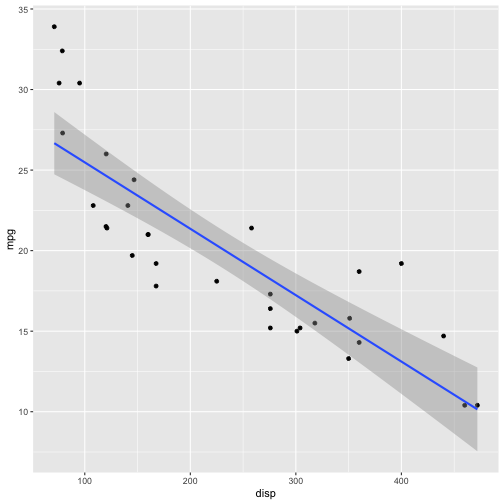
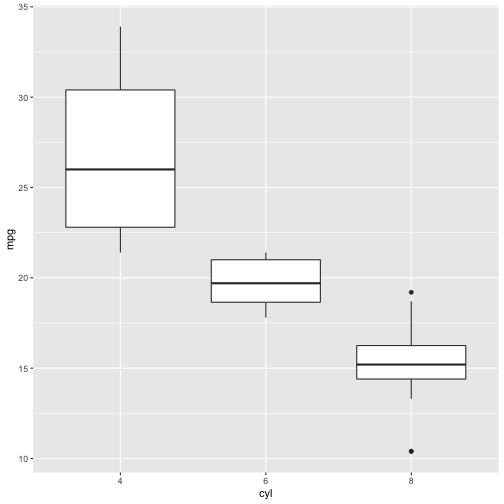

Course Project: Shiny Application and Reproducible Pitch
========================================================
author: Daniela Varela T
date: 20/03/2021
autosize: true

About the Assignment
========================================================

This is the final project for the *Developing data products* course as part of
the Coursera Data science specialization. 

The project is divided in tqo parts: the application and the presentation. 
The shiny application must be deployed in on Rstudio's shiny server, and the presentation must be pushed to github or Rpubs.


App functionality
========================================================

The purpose of is to show how you can create different kind of plots according to the input variable. The dataset for this implementation was mtcars, which comprises fuel consumption and 10 aspects of automobile design and performance for 32 automobiles.


```r
summary(mtcars)
```

```
      mpg             cyl             disp             hp       
 Min.   :10.40   Min.   :4.000   Min.   : 71.1   Min.   : 52.0  
 1st Qu.:15.43   1st Qu.:4.000   1st Qu.:120.8   1st Qu.: 96.5  
 Median :19.20   Median :6.000   Median :196.3   Median :123.0  
 Mean   :20.09   Mean   :6.188   Mean   :230.7   Mean   :146.7  
 3rd Qu.:22.80   3rd Qu.:8.000   3rd Qu.:326.0   3rd Qu.:180.0  
 Max.   :33.90   Max.   :8.000   Max.   :472.0   Max.   :335.0  
      drat             wt             qsec             vs        
 Min.   :2.760   Min.   :1.513   Min.   :14.50   Min.   :0.0000  
 1st Qu.:3.080   1st Qu.:2.581   1st Qu.:16.89   1st Qu.:0.0000  
 Median :3.695   Median :3.325   Median :17.71   Median :0.0000  
 Mean   :3.597   Mean   :3.217   Mean   :17.85   Mean   :0.4375  
 3rd Qu.:3.920   3rd Qu.:3.610   3rd Qu.:18.90   3rd Qu.:1.0000  
 Max.   :4.930   Max.   :5.424   Max.   :22.90   Max.   :1.0000  
       am              gear            carb      
 Min.   :0.0000   Min.   :3.000   Min.   :1.000  
 1st Qu.:0.0000   1st Qu.:3.000   1st Qu.:2.000  
 Median :0.0000   Median :4.000   Median :2.000  
 Mean   :0.4062   Mean   :3.688   Mean   :2.812  
 3rd Qu.:1.0000   3rd Qu.:4.000   3rd Qu.:4.000  
 Max.   :1.0000   Max.   :5.000   Max.   :8.000  
```

How to use the application
========================================================

The dependant variable (Y) is MPG always, you have to choose the independant variable (X) you want to explore. A plot will be shown according to the variable selected and it could be a scatter plot with a linear model fit or a box plot, depending on the choice. 

For example, if you choose the variable displacement, as it is continuous, the plot will be a scatter plot with the lm model. 


```r
library(ggplot2)

ggplot(mtcars, aes(x=disp, y=mpg)) + geom_point() + 
                xlab("disp") + ylab('mpg') + geom_smooth(method='lm')
```



...
========================================================
But if it is a categorical variable such as the number of cylinders, it will be a boxplot.  


```r
mtcars$cyl <- as.factor(mtcars$cyl)
ggplot(mtcars,aes(x=cyl, y=mpg))  + geom_boxplot() + xlab("cyl") + ylab('mpg')
```


Code structure
========================================================
- iu.R: contains helpText components and a set of radio buttons with the variables of the dataset as options. The main panel is composed only by a single plotOutput. 

- server.R: there is a reactive expression with an if statement to decide which type of plot to show depending on the input from the radio button. 


